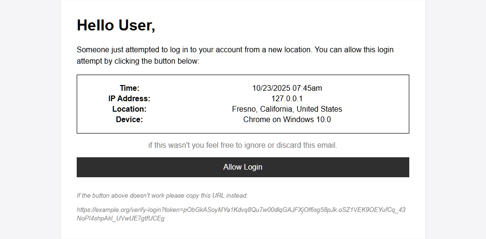

# 🔐 `@template-auth`
A self-hosted authentication and OAuth2 provider built with **Go** and **React**.  
Designed to act as a **central login server**, allowing smaller services to authenticate through its built-in OAuth2 framework.

> **For Contributors:** Each subdirectory is its own self-contained repository. 
> See their respective READMEs for implementation details.

- [🔐 `@template-auth`](#-template-auth)
  - [🔑 Security First](#-security-first)
  - [🎨 Customizable](#-customizable)
  - [🔀 OAuth2 Support](#-oauth2-support)
  - [🚨 Minimal and Auditable](#-minimal-and-auditable)
  - [📦 Provider Integration](#-provider-integration)
  - [Showcase](#showcase)

## 🔑 Security First
Protect users from account hijacking through layered security measures.  
By default, users must complete a security challenge whenever they:

- Log in from a **new IP address**
- Attempt a **sensitive action**

They’ll be prompted to verify ownership by one of the following:

- Using a **TOTP** (authenticator app) set up earlier  
- Entering a **passcode** sent to their email  
- **Re-entering their password**

## 🎨 Customizable
Users can personalize their profiles with custom display names, pronouns or 
subtitles, bios, avatars, banners, and accent colors.

Both the **frontend** and **email templates** can be customized by editing a 
few HTML or CSS files making it easy to tailor the experience to your brand.

## 🔀 OAuth2 Support
Acts as an OAuth2 provider for your ecosystem of services.  
Users can register applications, define scopes, and manage authorizations all 
within the frontend.

## 🚨 Minimal and Auditable
Lightweight Go backend with minimal dependencies and a clean, testable architecture.

You can spin up a full-stack preview instance (frontend + backend + database) using **Docker Compose**.  
See the [`preview`](https://github.com/bakonpancakz/template-auth/blob/main/preview) directory for setup instructions.

## 📦 Provider Integration
Includes built-in support for common services:

- **File Storage:** [AWS S3](https://aws.amazon.com/s3/) or local disk
- **Geolocation:** [IP2Location LITE](https://lite.ip2location.com/)
- **Email:** [AWS SES](https://aws.amazon.com/ses/), [EmailEngine](https://panca.kz/goto/emailengine)

## Showcase

<table align="center">
  <tbody>
    <tr>
      <td></td>
      <td></td>
    </tr>
    <tr>
      <td>
Verify Login Email
</td>
      <td>
Login Page
</td>
    </tr>
    <tr>
      <td></td>
      <td></td>
    </tr>
      <tr>
      <td>
Profile Customization
</td>
      <td>
Customized Frontend
</td>
    </tr>
  </tbody>
</table>

 
